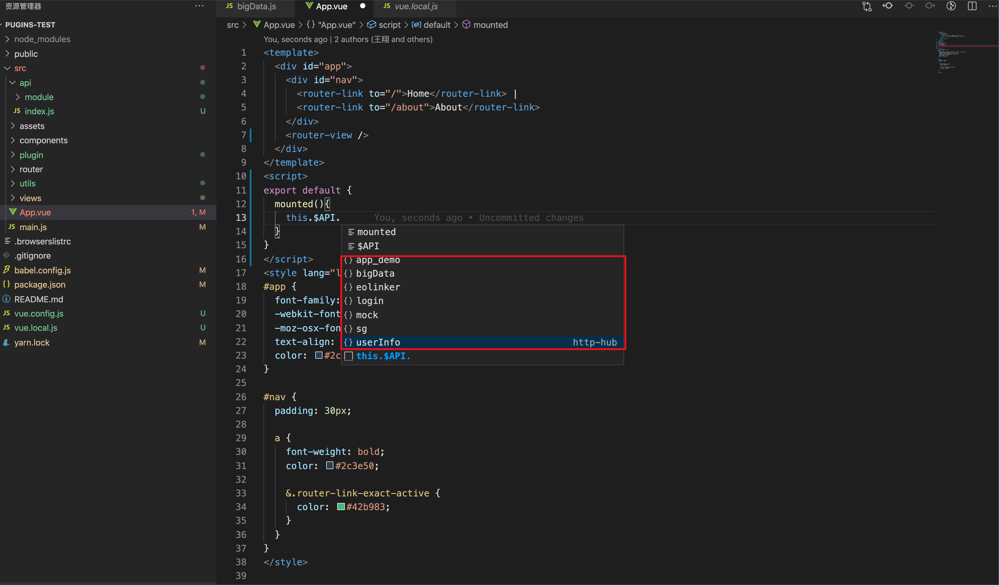
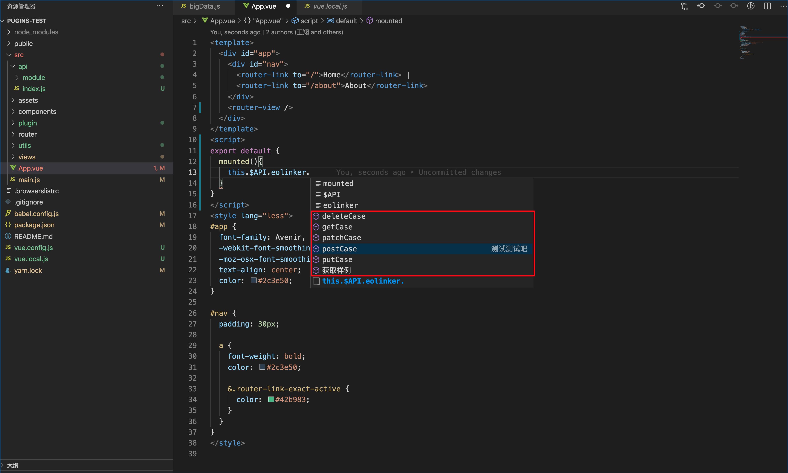

# http-hub-vsce

http-hub 工具专用插件，会根据定义的 api 进行代码提示，提高开发效率

## 使用方法

1. 安装 http-hub-auto-code
2. 在项目中按照 http-hub 规则进行创建 api 和 module 文件夹
3. 在 module 文件夹中创建 api 描述文件
4. 在 JavaScript 或 Vue 文件中开始你的编程吧

## 配置

- modulePath: 可设置扫描文件夹的相对路径，默认为/src/api/module

## 示例

### 提示模块

http-hub 会在 javascript 和 vue 文件中识别用户输入，在用户输入"$API"，并用"."进行触发后会提示已输入模块：

### 提示 API

在选择模块后再次输入"."会提示该模块下可调用的 API 并展示出对应的描述(desc)：

